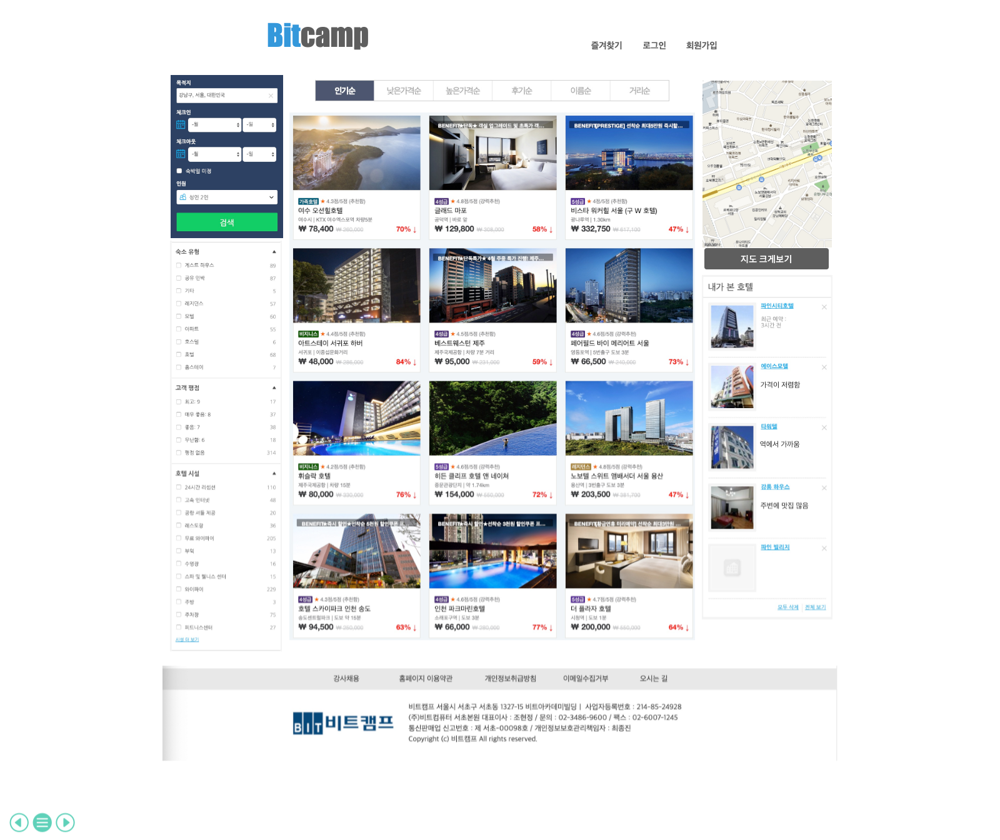

# UC001 - 숙소 검색하기(search)
비회원, 회원이 지역, 숙소명으로 검색하고 리스트를 출력하는 것.

## 주 액터(Primary Actor)
비회원, 회원

## 보조 액터(Secondary Actor)
리스트보기

## 사전 조건(Preconditions)
- 시스템이 검색창을 출력한 상태이다.

## 종료 조건(Postconditions)
- 시스템이 검색 조건에 맞는 숙소 리스트를 출력한다.

## 시나리오(Flow of Events)
### 기본 흐름(Basic Flow)
1. 액터가 지역명(도,시,군,구,동,면) 또는 역명 이나 숙소명으로 검색 버튼을 클릭할 때 이 유스케이스를 시작한다.
- 1.1 액터가 체크인 날짜를 선택하고 검색 버튼을 클릭 하면,
    - 시스템은 지역명, 숙소명과 체크인 날짜 이후에 예약할 수 있는 숙소 리스트를 출력한다.
- 1.2 액터가 체크인 날짜와 체크아웃 날짜를 선택하고 검색 버튼을 클릭하면,
    - 시스템은 지역명, 숙소명과 체크인 날짜 체크아웃 날짜에 예약할 수 있는 숙소 리스트를 출력한다.
- 1.3 액터가 객실당 인원 수를 입력하고 검색 버튼을 클릭하면,
    - 시스템은 지역명, 숙소명과 객실당 인원 수에 맞는 숙소 리스트를 출력한다.
- 1.4 액터가 체크인 날짜와 객실당 인원 수를 입력하고 검색 버튼을 클릭하면,
    - 시스템은 지역명, 숙소명과 체크인 날짜 이후와 객실당 인원 수에 맞는 숙소 리스트를 출력한다.
- 1.5 액터가 체크인 날짜, 체크아웃 날짜와 객실당 인원 수를 입력하고 검색 버튼을 클릭하면,
    - 시스템은 지역명, 숙소명과 체크인, 체크아웃 날짜, 객실당 인원 수에 맞는 숙소 리스트를 출력한다.
- 1.6 액터가 지역명 첫글짜를 입력하면,
    - 시스템은 검색창 밑에 첫글짜에 해당하는 지역명을 가나다 순으로 미리 출력한다.
2. 시스템은 숙소 리스트(숙소 목록(숙소명, 숙박비, 지역명(동까지)), 검색창, 필터, 작은지도(검색한 지역이나 숙소 기준), 지도크게보기, 찜한목록(숙소명, 메모))를 출력한다.
- 2.1 액터가 필터()를 클릭하면,
    - 시스템은 해당하는 필터 조건에 맞는 숙소 리스트를 출력한다.

### 예외 흐름(Exception Flows)
- 1.1 검색 조건이 비어 있으면,
    - 시스템은 검색 조건이 비어 있음을 알리는 내용을 출력한다.
- 1.2 지역명, 숙소명, 체크인, 체크아웃, 객실당 인원 수를 입력 하고 검색 버튼을 눌렀지만 해당하는 숙소가 없으면,
    - 시스템은 숙소 리스트에 해당하는 숙소가 없음을 알리는 내용을 출력한다.

## UI 프로토타입

### 검색창

### 숙소 리스트

